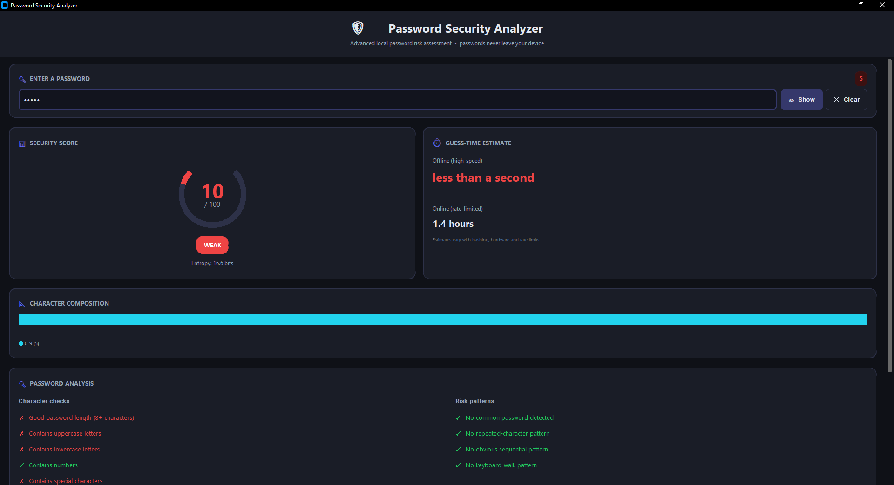
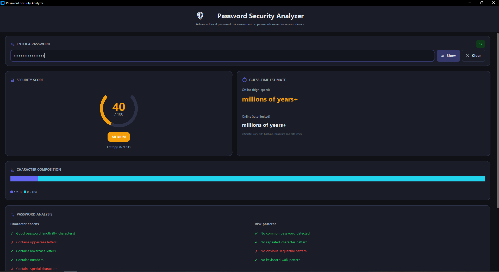
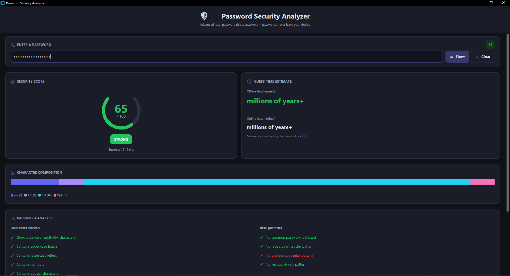
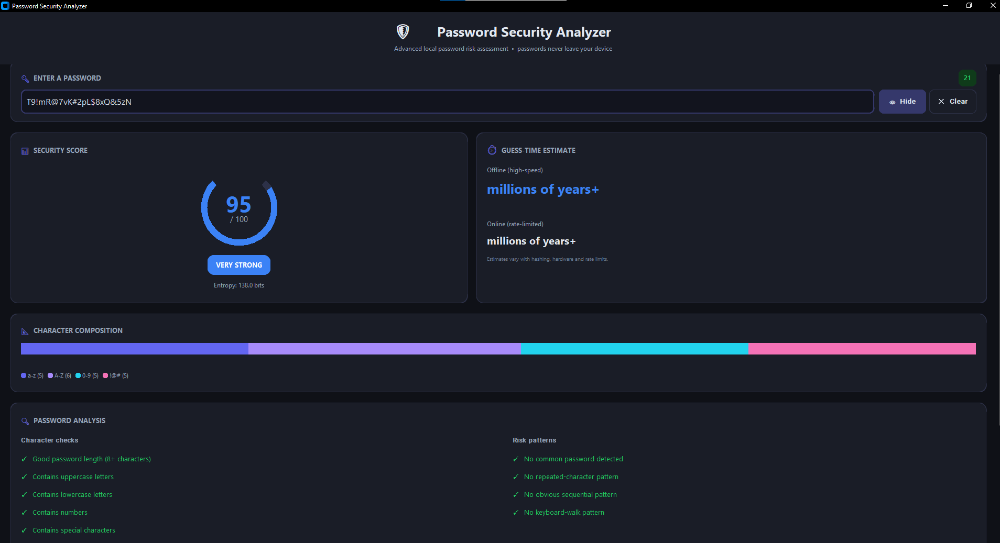
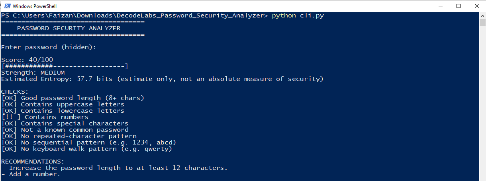

# 🔐 Password Security Analyzer

An advanced Python-based Password Strength Checker developed for the **DecodeLabs Cyber Security Industrial Training Program – Project 1**.

The application analyzes password strength, identifies common security weaknesses and provides personalized recommendations to help users create stronger passwords.

---

## 📌 Project Information

- **Official Project:** Password Strength Checker
- **Advanced Project Title:** Password Security Analyzer
- **Domain:** Cyber Security
- **Platform:** DecodeLabs
- **Project:** Project 1

---

## 🎯 Project Objective

The objective of this project is to analyze a password and determine its strength based on multiple security factors.

The application evaluates password length, character variety and potentially predictable patterns, then classifies the password as:

- 🔴 Weak
- 🟠 Medium
- 🟢 Strong
- 🔵 Very Strong

---

## ✨ Features

### Core Password Analysis

- Password length analysis
- Uppercase letter detection
- Lowercase letter detection
- Number detection
- Special character detection
- Password strength classification

### Advanced Security Analysis

- Security score out of 100
- Common-password detection
- Common-password variation detection
- Repeated-character detection
- Sequential-pattern detection
- Keyboard-pattern detection
- Password entropy estimation
- Estimated password guess time
- Personalized security recommendations

### Modern Graphical Interface

- Modern dark-themed GUI
- Password hidden by default
- Show/Hide password option
- Animated circular security score
- Animated score updates
- Colour-coded strength indicator
- Character composition visualization
- Live character counter
- Detailed password analysis checklist
- Guess-time estimation
- Personalized recommendations
- Clear password option

### Command-Line Interface

- Hidden password input using `getpass`
- Detailed security analysis
- Score and strength classification
- Security recommendations

### Testing

- Unit tests for password analysis functionality
- Testing of password characteristics
- Testing of common passwords
- Testing of repeated and sequential patterns
- Testing of password strength classification

---

## 🖥️ Screenshots

> **Note:** All passwords shown below are sample passwords created for demonstration purposes.

### 🔴 Weak Password



### 🟠 Medium Password



### 🟢 Strong Password



### 🔵 Very Strong Password



### 💻 Command-Line Interface



---

## 🛠️ Technologies Used

- Python 3
- CustomTkinter
- `re`
- `math`
- `getpass`
- `unittest`

---

## 📂 Project Structure

```text
decodelabs-password-security-analyzer/
│
├── password_analyzer.py
├── guess_time_estimator.py
├── gui.py
├── cli.py
│
├── data/
│   └── common_passwords.txt
│
├── tests/
│   └── test_analyzer.py
│
├── screenshots/
│   ├── weak_password.png
│   ├── medium_password.png
│   ├── strong_password.png
│
├── requirements.txt
├── README.md
├── LICENSE
└── .gitignore
```

---

## ⚙️ Installation

### 1. Clone the Repository

```bash
git clone https://github.com/YOUR-USERNAME/decodelabs-password-security-analyzer.git
```

### 2. Navigate to the Project Directory

```bash
cd decodelabs-password-security-analyzer
```

### 3. Install Dependencies

```bash
pip install -r requirements.txt
```

### Optional: Create a Virtual Environment

```bash
python -m venv venv
```

Activate it on Windows:

```bash
venv\Scripts\activate
```

Then install the dependencies:

```bash
pip install -r requirements.txt
```

---

## 🚀 Usage

### Run the Graphical Interface

```bash
python gui.py
```

Enter a password and the application will automatically analyze its security characteristics.

### Run the Command-Line Interface

```bash
python cli.py
```

The password is entered using hidden terminal input and analyzed using the same core password analysis engine.

---

## 🔍 Password Analysis Methodology

The application analyzes passwords in multiple stages.

### 1. Character Analysis

The password is checked for:

- Length
- Lowercase letters
- Uppercase letters
- Numbers
- Special characters

### 2. Risk Pattern Detection

The application checks for potentially weak or predictable patterns, including:

- Common passwords
- Common password variations
- Repeated characters
- Sequential patterns
- Keyboard patterns

Examples of predictable patterns include:

```text
1234
abcd
4321
qwerty
asdf
aaaaaa
111111
```

### 3. Security Score

The password receives a security score between:

```text
0 ───────────────────────── 100
```

The score is then used to classify the password strength.

### 4. Entropy Estimation

The application estimates password entropy based on password length and character variety.

Entropy is an estimate and should not be interpreted as an absolute guarantee of password security.

### 5. Guess-Time Estimation

The application estimates resistance to password guessing under illustrative scenarios.

The estimates include:

- Offline high-speed guessing
- Online rate-limited guessing

### 6. Personalized Recommendations

The application identifies weaknesses and provides recommendations for improving password security.

---

## 📊 Password Strength Classification

| Score | Classification |
|---|---|
| 0–39 | Weak |
| 40–64 | Medium |
| 65–84 | Strong |
| 85–100 | Very Strong |

---

## ⏱️ Guess-Time Estimation

Guess-time estimates are intended to provide an approximate indication of password resistance.

Actual cracking time can vary significantly depending on:

- Password hashing algorithm
- Hash configuration
- Attacker hardware
- Attack strategy
- Rate limiting
- Account lockout policies
- Multi-factor authentication

Therefore, guess-time results should be considered **estimates only**.

---

## 🔒 Security and Privacy

The project is designed to perform password analysis locally.

- Passwords are analyzed locally in memory.
- Passwords are not intentionally saved to files.
- Passwords are not stored in a database.
- Passwords are not intentionally logged.
- Passwords are not transmitted over the network.
- The GUI hides passwords by default.
- The CLI uses hidden password input.

---

## 🧪 Running Tests

Run the following command from the project root:

```bash
python -m unittest discover -s tests -v
```

The tests cover areas such as:

- Empty passwords
- Short passwords
- Common-password detection
- Character-type detection
- Missing uppercase letters
- Missing lowercase letters
- Missing numbers
- Missing special characters
- Repeated-character patterns
- Sequential patterns
- Keyboard patterns
- Password strength classification
- Score boundaries

---

## ⚠️ Disclaimer

This project is an educational password analysis tool developed for the **DecodeLabs Cyber Security Project 1**.

Password strength scores, entropy values and guess-time estimates are based on implemented heuristics and assumptions. They do not guarantee that a password is secure or accurately predict the time required to crack a password in every real-world scenario.

For important accounts, users should also consider:

- Using a unique password for every account
- Using long passphrases
- Using a reputable password manager
- Enabling multi-factor authentication

---

## 👤 Author

**Faizan Manazir**

Cybersecurity and Digital Forensics

Developed for **DecodeLabs Cyber Security Industrial Training Program – Project 1**

---
