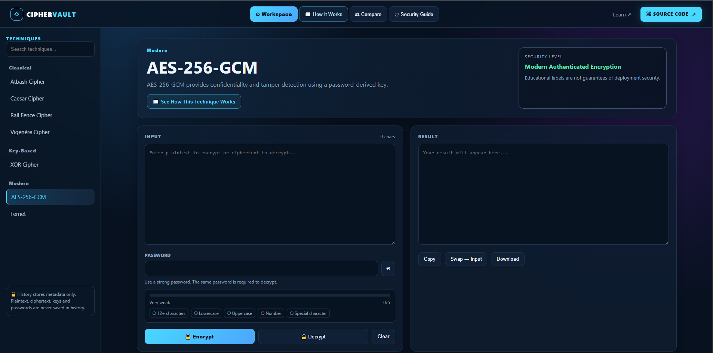
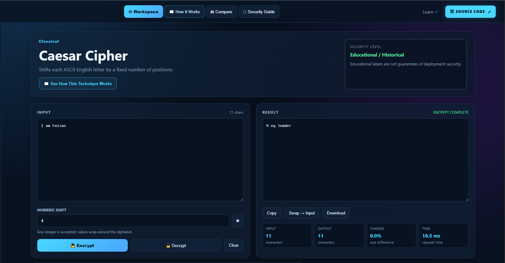
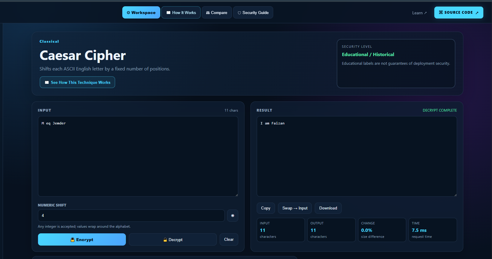
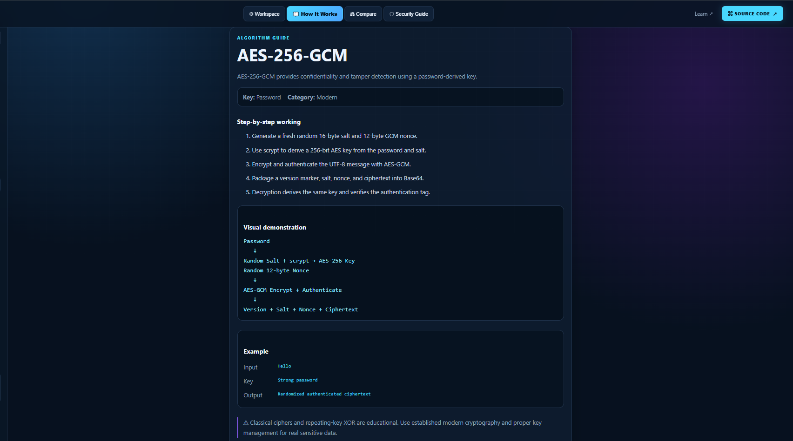
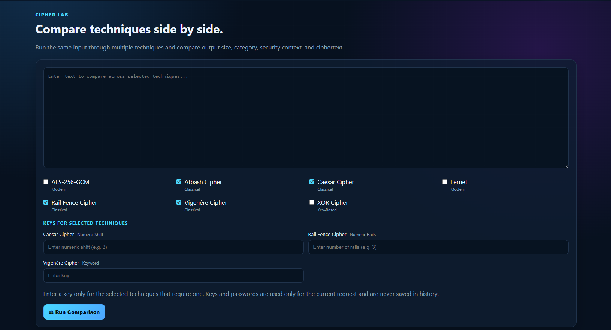
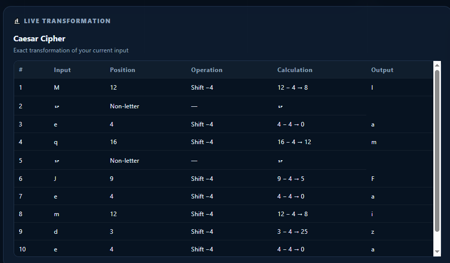

# 🔐 CipherVault — Multi-Technique Encryption & Decryption Lab



CipherVault is an interactive Python/Flask cryptography application that combines **classical ciphers, key-based transformations, and modern authenticated encryption** in one cybersecurity-focused workspace.

Instead of being only an encrypt/decrypt tool, CipherVault also explains how algorithms work, allows users to compare techniques side by side, visualizes transformations, provides security guidance, and displays operation statistics.

> **Project Context:** Developed as an enhanced **Basic Encryption & Decryption** project for the **Prodigy InfoTech Cyber Security Internship**.

> **Educational Note:** Classical ciphers and the repeating-key XOR implementation are included for learning and demonstration. Fernet and AES-256-GCM are the modern options in this project. Base64 is intentionally **not included as a standalone technique** because it is encoding, not encryption.

---

## ✨ Features

### 🔐 Encryption & Decryption Workspace

- Encrypt and decrypt text from a single workspace
- Dynamic algorithm selection
- Dynamic key/password fields based on the selected technique
- Input validation and user-friendly error messages
- Copy result functionality
- Clear/reset functionality
- Operation status feedback
- Responsive cybersecurity-themed interface

### 🧩 Multiple Cryptographic Techniques

CipherVault includes:

- Caesar Cipher
- Vigenère Cipher
- Atbash Cipher
- Rail Fence Cipher
- XOR Cipher
- Fernet
- AES-256-GCM

### 📖 How It Works

A dedicated learning section explains:

- What each technique does
- Required key type
- Encryption/decryption workflow
- Security level
- Example usage
- Step-by-step algorithm logic
- The difference between educational and modern cryptography

### 🔬 Live Transformation Lab

After an operation, CipherVault can visualize how the current input is processed.

Depending on the algorithm, it can show:

- Character positions and shifts
- Vigenère key alignment and modular arithmetic
- Atbash alphabet mirroring
- XOR byte-level binary operations
- Rail Fence zig-zag paths
- Modern encryption pipelines for Fernet and AES-256-GCM

To keep the interface readable, detailed visualizations are limited to the first **60 characters**.

### ⚖️ Cipher Comparison Lab

Users can select multiple techniques and compare their encryption output side by side.

The comparison tool includes:

- Multi-algorithm selection
- Individual key fields for techniques that require keys
- Dynamic key inputs
- Input validation
- Output comparison
- Security/category information
- Output length information

### 📊 Encryption Statistics

The application provides operation information such as:

- Input size
- Output size
- Size change
- Processing time

### 🔑 Password Strength Feedback

Modern password-based techniques include password-strength feedback to encourage stronger passwords.

### 🛡️ Security Guide

The Security Guide helps distinguish between:

- Classical/educational techniques
- Key-based transformations
- Modern authenticated encryption

It also explains why **Base64 is not encryption** and is therefore not presented as a CipherVault encryption technique.

### ⌘ Direct Source Code Link

A prominent **SOURCE CODE ↗** button is included in the navigation.

Clicking it opens the project's GitHub repository directly in a new browser tab.

---

# 📸 Application Screenshots

> Create a `screenshots/` folder in the repository and place the screenshots below inside it using the same filenames.

## 🏠 Main Workspace

The primary CipherVault workspace allows the user to select a technique, enter text, provide a key or password when required, and encrypt or decrypt the data.


---

## 🔐 Encryption Result

After encryption, the application displays the resulting ciphertext together with operation information.



---

## 🔓 Decryption Result

The same workspace can decrypt supported ciphertext when the correct algorithm and key/password are supplied.



---

## 🔬 Live Transformation

The bottom-left Live Transformation panel visualizes how the user's input is processed by the selected algorithm.

For example, Caesar Cipher can display character positions, shifts, calculations, and resulting characters.


---

## 📖 How It Works

The dedicated learning section explains the working, key requirements, examples, and security context of each technique.



---

## ⚖️ Cipher Comparison Lab

Users can select multiple algorithms and compare their outputs side by side.

Each selected key-based algorithm receives its own key input.



---

## 🔬 Live Transformation

The bottom-left Live Transformation panel visualizes how the user's input is processed by the selected algorithm.

For example, Caesar Cipher can display character positions, shifts, calculations, and resulting characters.



---

# 🧠 Supported Techniques

| Technique | Category | Key Required | Key Type | Security Context |
|---|---|---:|---|---|
| Caesar Cipher | Classical | Yes | Numeric Shift | Educational |
| Vigenère Cipher | Classical | Yes | Text Key | Educational |
| Atbash Cipher | Classical | No | None | Educational |
| Rail Fence Cipher | Classical | Yes | Number of Rails | Educational |
| XOR Cipher | Key-Based | Yes | Secret Key | Educational / Demonstration |
| Fernet | Modern | Yes | Password | Authenticated Encryption |
| AES-256-GCM | Modern | Yes | Password | Authenticated Encryption |

---

# ⚙️ How CipherVault Works

## General Workflow

```text
User Input
    │
    ▼
Select Technique
    │
    ▼
Enter Key / Password (if required)
    │
    ▼
Choose Encrypt or Decrypt
    │
    ▼
Flask API
    │
    ▼
CryptoService
    │
    ▼
Selected Algorithm
    │
    ▼
Result
    │
    ├──► Output Panel
    ├──► Live Transformation
    ├──► Encryption Statistics
    └──► Recent Operations
```

---

# 🔐 Technique Details

## 1. Caesar Cipher

The Caesar Cipher shifts alphabetic characters by a fixed number of positions.

### Encryption

```text
Plaintext Character
        │
        ▼
Alphabet Position
        │
        ▼
Add Shift Value
        │
        ▼
Wrap Around Alphabet
        │
        ▼
Ciphertext Character
```

Example with a shift of `3`:

```text
HELLO
  ↓
KHOOR
```

Conceptually:

```text
Encrypted Position = (Plaintext Position + Shift) mod 26
```

Decryption reverses the shift:

```text
Plaintext Position = (Ciphertext Position - Shift) mod 26
```

**Security:** Educational only.

---

## 2. Vigenère Cipher

The Vigenère Cipher uses a repeating alphabetic key to determine the shift for each letter.

Example:

```text
Plaintext: HELLO
Key:       KEYKE
```

Each plaintext character is combined with the corresponding key character.

Conceptually:

```text
Cipher Position = (Plain Position + Key Position) mod 26
```

Decryption subtracts the key position.

**Security:** Educational only.

---

## 3. Atbash Cipher

Atbash maps each alphabetic character to its mirrored character in the alphabet.

```text
A ↔ Z
B ↔ Y
C ↔ X
...
```

Example:

```text
HELLO
  ↓
SVOOL
```

The same operation is used for both encryption and decryption.

**Security:** Educational only.

---

## 4. Rail Fence Cipher

Rail Fence is a transposition cipher.

Characters are placed in a zig-zag pattern across a selected number of rails and then read row by row.

Example concept:

```text
W . . E . . C . .
. E . R . D . S .
. . A . . I . . V
```

The encrypted output is produced by reading the rails sequentially.

**Security:** Educational only.

---

## 5. XOR Cipher

CipherVault's XOR implementation converts the message and key into bytes, repeats the key as necessary, and XORs corresponding bytes.

Conceptually:

```text
Cipher Byte = Message Byte XOR Key Byte
```

Because XOR is reversible:

```text
Message Byte = Cipher Byte XOR Key Byte
```

The binary transformation can be explored in the Live Transformation panel.

The encrypted byte sequence is packaged into printable text for display.

**Security:** Educational/key-based demonstration. Repeating-key XOR should not be treated as modern secure encryption.

---

## 6. Fernet

CipherVault uses the `cryptography` library's Fernet implementation with a password-derived key.

### Encryption Flow

```text
Plaintext
    │
    ▼
Generate Random Salt
    │
    ▼
scrypt Key Derivation
    │
    ▼
Fernet Authenticated Encryption
    │
    ▼
Pack Salt + Token
    │
    ▼
Ciphertext Package
```

The password is not used directly as the Fernet key. A key is derived using `scrypt` and a fresh random salt.

During decryption:

```text
Ciphertext Package
    │
    ▼
Recover Salt
    │
    ▼
Derive Same Key from Password
    │
    ▼
Fernet Verification & Decryption
    │
    ▼
Plaintext
```

**Security:** Modern authenticated encryption when implemented and managed correctly.

---

## 7. AES-256-GCM

AES-256-GCM provides authenticated encryption.

CipherVault derives a 256-bit AES key from the password using `scrypt`.

### Encryption Flow

```text
Plaintext
    │
    ▼
Generate Random Salt
    │
    ▼
Generate Fresh GCM Nonce
    │
    ▼
scrypt Password-Based Key Derivation
    │
    ▼
AES-256-GCM Encryption + Authentication
    │
    ▼
Package Version + Salt + Nonce + Ciphertext
    │
    ▼
Ciphertext Output
```

During decryption, the application:

1. Reads the package.
2. Recovers the salt and nonce.
3. Derives the same AES key from the supplied password.
4. Attempts authenticated decryption.
5. Rejects the operation when authentication fails.

**Security:** Modern authenticated encryption when implemented and managed correctly.

---

# 🔬 Live Transformation Lab

The Live Transformation panel changes according to the selected technique.

## Classical Ciphers

For Caesar, Vigenère, and Atbash, CipherVault can show:

```text
Input Character
      │
      ▼
Alphabet Position
      │
      ▼
Algorithm-Specific Operation
      │
      ▼
Output Character
```

## XOR

The application can display a byte-level view:

```text
Message Byte:  01001000
Key Byte:      01001011
               --------
XOR Result:    00000011
```

## Rail Fence

The application visualizes the character path:

```text
Character 1 → Rail 1
Character 2 → Rail 2
Character 3 → Rail 3
Character 4 → Rail 2
Character 5 → Rail 1
```

## Modern Encryption

Fernet and AES-256-GCM do not have a meaningful fixed one-character-to-one-character mapping.

For these algorithms, CipherVault displays an accurate high-level pipeline instead:

```text
Text
  ↓
UTF-8 Bytes
  ↓
Password + Random Salt
  ↓
Key Derivation
  ↓
Authenticated Encryption
  ↓
Randomized Ciphertext
```

The same plaintext can produce different ciphertext because fresh random values are used during encryption.

---

# ⚖️ Cipher Comparison Lab

The Comparison Lab allows multiple techniques to be evaluated from one input.

```text
Plaintext
    │
    ├──► Caesar Cipher + Shift
    │
    ├──► Vigenère Cipher + Key
    │
    ├──► XOR Cipher + Secret Key
    │
    ├──► Fernet + Password
    │
    └──► AES-256-GCM + Password
              │
              ▼
      Side-by-Side Results
```

### Key Handling

The comparison interface dynamically displays an individual key field for each selected technique that requires one.

Examples:

- Caesar → Numeric shift
- Vigenère → Text key
- Rail Fence → Number of rails
- XOR → Secret key
- Fernet → Password
- AES-256-GCM → Password

Keys are used only for the current request and are not stored in the operation history.

---

# 🛡️ Security Guide

CipherVault separates techniques conceptually:

### Educational Techniques

- Caesar
- Vigenère
- Atbash
- Rail Fence
- Repeating-key XOR

These are useful for understanding cryptographic concepts but should not be used to protect sensitive real-world data.

### Modern Techniques

- Fernet
- AES-256-GCM

These provide authenticated encryption through established cryptographic primitives when used with proper passwords, key management, and deployment practices.

### Why Base64 Is Not Included

Base64 is intentionally excluded as a CipherVault technique because:

```text
Base64 = Encoding
Encryption = Confidentiality using a secret/key
```

Base64 changes the representation of data so that bytes can be represented as text. It does not provide secrecy.

---

# 🧰 Technology Stack

## Backend

- Python
- Flask
- `cryptography`

## Frontend

- HTML5
- CSS3
- Vanilla JavaScript

## Testing

- Pytest

---

# 📂 Project Structure

```text
CipherVault/
│
├── app.py
├── config.py
├── requirements.txt
├── README.md
├── .gitignore
│
├── algorithms/
│   ├── __init__.py
│   ├── base.py
│   ├── caesar.py
│   ├── vigenere.py
│   ├── atbash.py
│   ├── rail_fence.py
│   ├── xor_cipher.py
│   ├── fernet_cipher.py
│   └── aes_gcm.py
│
├── routes/
│   ├── __init__.py
│   └── api.py
│
├── services/
│   ├── __init__.py
│   └── crypto_service.py
│
├── templates/
│   ├── index.html
│   └── learn.html
│
├── static/
│   ├── css/
│   │   └── style.css
│   ├── img/
│   │   └── favicon.svg
│   └── js/
│       └── app.js
│
├── tests/
│   └── test_crypto.py
│
└── screenshots/
    ├── workspace.png
    ├── encryption-result.png
    ├── decryption-result.png
    ├── live-transformation.png
    ├── how-it-works.png
    ├── comparison-lab.png
    ├── security-guide.png
    ├── password-strength.png
    ├── encryption-statistics.png
    └── source-code-link.png
```

---

# 🚀 Installation

## Prerequisites

- Python 3.10 or later
- pip

## 1. Clone the Repository

```bash
git clone https://github.com/YOUR-USERNAME/CipherVault.git
```

## 2. Navigate to the Project

```bash
cd CipherVault
```

## 3. Create a Virtual Environment

```bash
python -m venv venv
```

### Windows

```bash
venv\Scripts\activate
```

### Linux/macOS

```bash
source venv/bin/activate
```

## 4. Install Dependencies

```bash
pip install -r requirements.txt
```

## 5. Run CipherVault

```bash
python app.py
```

Open:

```text
http://127.0.0.1:5000
```

---

# 🧪 Running Tests

Run:

```bash
pytest
```

Or:

```bash
python -m pytest
```

---

# 🔌 API Endpoints

| Method | Endpoint | Description |
|---|---|---|
| `GET` | `/api/algorithms` | Returns supported algorithm information |
| `POST` | `/api/encrypt` | Encrypts text |
| `POST` | `/api/decrypt` | Decrypts text |
| `POST` | `/api/compare` | Encrypts one input using multiple selected techniques |

## Example Encryption Request

```json
{
  "algorithm": "caesar",
  "text": "HELLO",
  "key": "3"
}
```

## Example Response

```json
{
  "success": true,
  "operation": "encrypt",
  "algorithm": "caesar",
  "result": "KHOOR"
}
```

---

# ⌘ Configure the Source Code Link

The application contains a direct repository button.

Search for this placeholder in:

```text
templates/index.html
templates/learn.html
```

Replace:

```text
https://github.com/YOUR-USERNAME/CipherVault
```

with your real repository URL:

```text
https://github.com/YOUR-USERNAME/YOUR-REPOSITORY
```

The **SOURCE CODE ↗** button will then open your GitHub repository directly.

---

# ⚠️ Important Security Note

CipherVault is partly an **educational cryptography project**.

The following techniques should not be used for protecting sensitive information:

- Caesar Cipher
- Vigenère Cipher
- Atbash Cipher
- Rail Fence Cipher
- Repeating-key XOR

For real applications, use established cryptographic libraries and modern authenticated encryption rather than implementing cryptographic primitives manually.

Fernet and AES-256-GCM in this project rely on the Python `cryptography` library, but real-world security still depends on factors such as:

- Strong passwords
- Secure key management
- Correct deployment
- Updated dependencies
- Appropriate access control
- Threat modeling

---

# 🎓 Internship Context

This project was developed for the:

**Prodigy InfoTech Cyber Security Internship**

The original task required a basic text encryption/decryption implementation. CipherVault expands that idea into a larger educational cryptography application featuring:

- Multiple encryption techniques
- Classical and modern approaches
- Encryption and decryption workflows
- Algorithm explanations
- Live transformation visualization
- Side-by-side cipher comparison
- Security guidance
- Password-strength feedback
- Operation statistics
- Flask API architecture
- Automated tests
- A modern responsive GUI

---

# 🚀 Future Improvements

Possible future enhancements include:

- File encryption
- Secure key import/export
- Additional authenticated encryption modes
- Public-key encryption demonstrations
- Hashing and digital signature modules
- Docker support
- Rate limiting
- Accessibility improvements
- More automated test coverage
- Deployment configuration
- Dark/light theme switching

---

# 📜 License

This project is licensed under the terms specified in the `LICENSE` file, if included in the repository.

---

## 🔐 CipherVault

**Encrypt • Decrypt • Compare • Learn • Visualize**

A portfolio-oriented cryptography project demonstrating classical ciphers, modern authenticated encryption, Flask backend development, interactive UI design, cryptographic visualization, and cybersecurity fundamentals.
